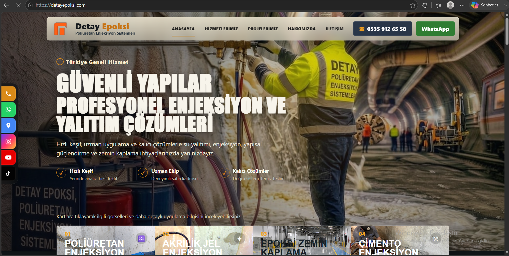
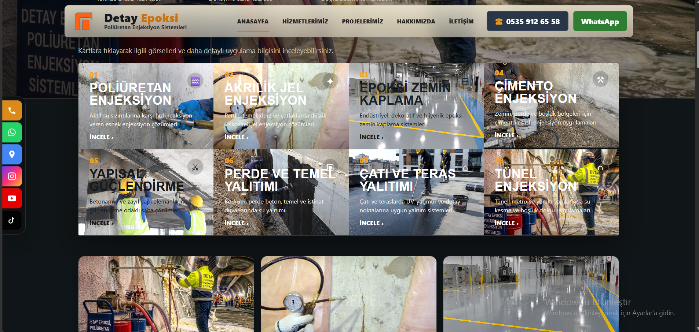
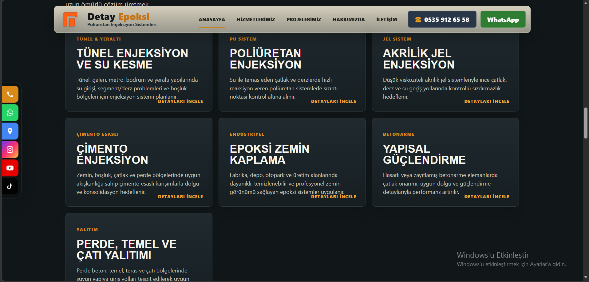

# Detay Epoksi — Corporate Website

A live corporate website developed for **Detay Epoksi**, a company providing polyurethane injection, waterproofing, structural reinforcement and epoxy flooring solutions.

## Overview

The website was designed to present the company's technical services in a clear, visual and conversion-focused structure.

The project combines a strong industrial visual identity with direct contact channels and service-focused content.

## Key Features

- Responsive corporate website
- Service-focused landing experience
- Polyurethane injection services
- Acrylic gel injection
- Epoxy floor coating
- Cement injection
- Structural reinforcement
- Curtain wall, foundation and roof waterproofing
- Tunnel injection and underground water sealing
- Project / application showcase
- Phone and WhatsApp contact actions
- Social media shortcuts
- Mobile-friendly navigation

## Screenshots

### Homepage / Hero

### Service Grid

### Service Detail Layout

## My Role

I worked on:

- Requirements analysis
- UI / UX development
- Responsive layout implementation
- Service presentation structure
- Visual hierarchy and content layout
- Contact and WhatsApp integrations
- Testing and revisions
- Deployment / live environment work

## Live Website

https://detayepoksi.com

## Source Code

The production source code is private because this was developed as a real client project.

This repository is intended only as a public project showcase.

## Status

**Production / Live**
